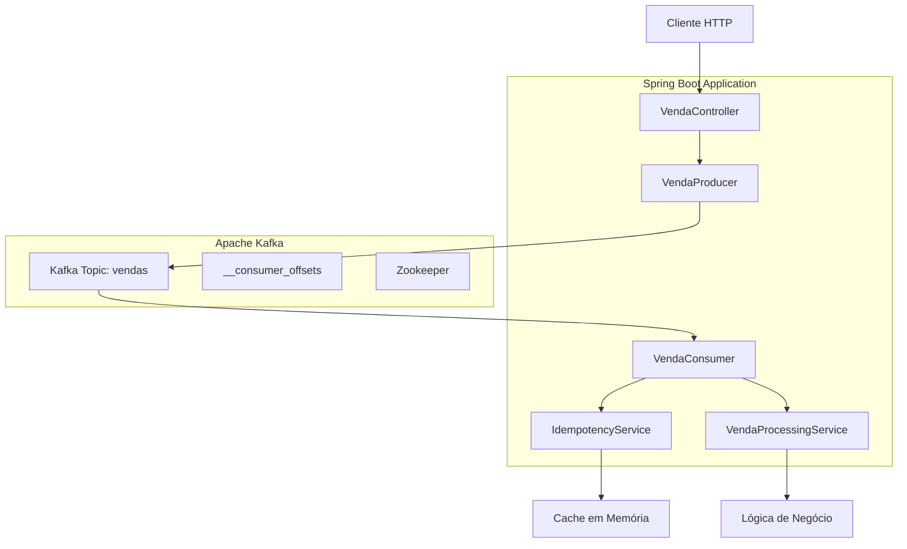
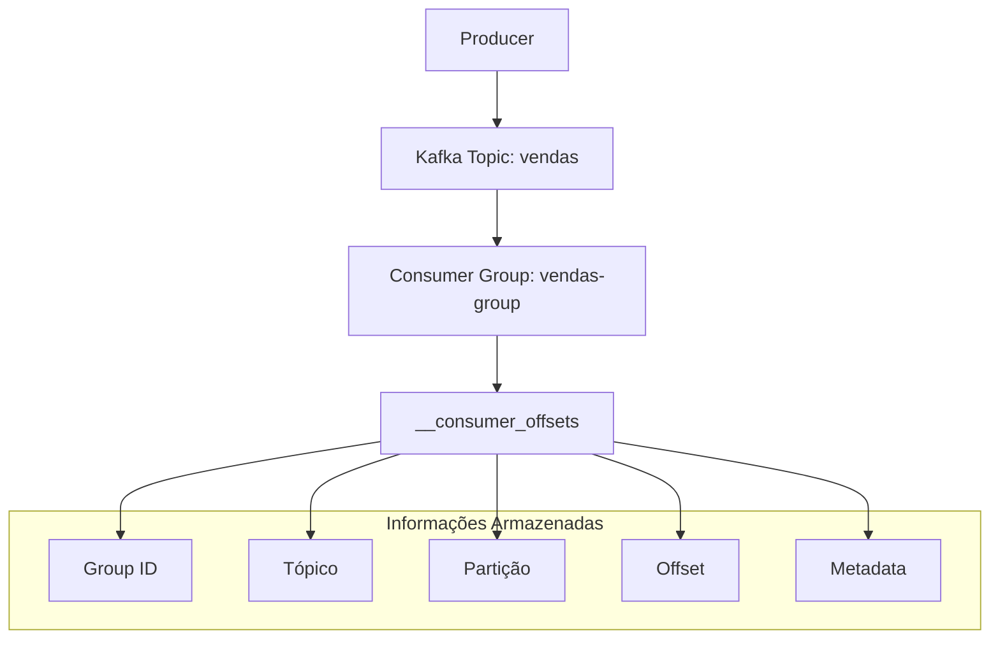

# Sistema de Vendas com Apache Kafka

Este é um sistema de processamento de vendas desenvolvido com Spring Boot e Apache Kafka, demonstrando as melhores práticas de arquitetura distribuída, idempotência e processamento assíncrono.

## 📋 Índice

- [Visão Geral](#visão-geral)
- [Arquitetura](#arquitetura)
- [Tecnologias Utilizadas](#tecnologias-utilizadas)
- [Funcionalidades](#funcionalidades)
- [Como Executar](#como-executar)
- [API Documentation](#api-documentation)
- [Testes](#testes)
- [Kafka e Consumer Offsets](#kafka-e-consumer-offsets)
- [Contribuindo](#contribuindo)

## 🎯 Visão Geral

O sistema permite o recebimento de vendas via API REST e as processa assincronamente através do Apache Kafka, garantindo:

- **Idempotência**: Processamento único de vendas duplicadas
- **Exactly-Once Processing**: Garantia de processamento sem duplicatas
- **Alta Performance**: Processamento assíncrono e paralelo
- **Observabilidade**: Logs detalhados e monitoramento via Actuator
- **Documentação Interativa**: Interface Swagger para testes

## 🏗️ Arquitetura



### Componentes Principais

- **VendaController**: Endpoint REST para recebimento de vendas
- **VendaProducer**: Serviço para envio de mensagens ao Kafka
- **VendaConsumer**: Consumidor Kafka para processamento de vendas
- **IdempotencyService**: Controle de duplicatas e idempotência
- **VendaProcessingService**: Lógica de negócio de processamento

## 🛠️ Tecnologias Utilizadas

- **Java 17**: Linguagem de programação
- **Spring Boot 3.2.1**: Framework principal
- **Spring Kafka**: Integração com Apache Kafka
- **Apache Kafka**: Sistema de mensageria distribuído
- **Swagger/OpenAPI 3**: Documentação da API
- **JUnit 5**: Framework de testes
- **Mockito**: Mocks para testes unitários
- **TestContainers**: Testes de integração com Kafka real
- **Maven**: Gerenciamento de dependências

## ✨ Funcionalidades

### 1. Recebimento de Vendas
- Endpoint REST para criação de vendas
- Validação de entrada com Bean Validation
- Resposta imediata (HTTP 202) para o cliente

### 2. Processamento Assíncrono
- Envio das vendas para tópico Kafka
- Processamento em background
- Garantia de exactly-once delivery

### 3. Controle de Idempotência
- Detecção automática de vendas duplicadas
- Cache em memória para IDs processados
- Logs detalhados de operações

### 4. Monitoramento
- Health check endpoints
- Logs estruturados com diferentes níveis
- Métricas via Spring Actuator

## 🚀 Como Executar

### Pré-requisitos
- Java 17 ou superior
- Maven 3.6 ou superior
- Docker e Docker Compose (para Kafka)

### 1. Subir a infraestrutura Kafka
```bash
docker-compose up -d
```

### 2. Executar a aplicação
```bash
mvn spring-boot:run
```

### 3. Acessar a aplicação
- **API**: http://localhost:8080/api/v1/vendas
- **Swagger UI**: http://localhost:8080/swagger-ui.html
- **Health Check**: http://localhost:8080/actuator/health

## 📚 API Documentation

A documentação completa da API está disponível através do Swagger UI em: http://localhost:8080/swagger-ui.html

### Principais Endpoints

#### POST /api/v1/vendas
Cria uma nova venda para processamento.

**Request Body:**
```json
{
  "pedidoId": 12345,
  "produto": "Notebook Dell Inspiron",
  "valor": 2500.99,
  "quantidade": 2,
  "emailCliente": "cliente@email.com"
}
```

**Response (202):**
```json
{
  "message": "Venda enviada para processamento",
  "pedidoId": 12345,
  "status": "ACCEPTED"
}
```

#### GET /api/v1/vendas/health
Verifica a saúde do serviço de vendas.

**Response (200):**
```
Serviço de vendas funcionando!
```

## 🧪 Testes

O projeto possui uma suíte abrangente de testes seguindo as práticas de TDD:

### Estrutura de Testes

```
src/test/java/
├── controller/          # Testes de controladores (MockMvc)
├── dto/                # Testes de DTOs (validação, serialização)
├── integration/        # Testes de integração (Kafka real)
├── listener/           # Testes de consumers Kafka
├── producer/           # Testes de producers Kafka
└── service/            # Testes de serviços (lógica de negócio)
```

### Tipos de Testes

1. **Testes Unitários**: Validação de lógica isolada
2. **Testes de Integração**: Testes com Kafka real via TestContainers
3. **Testes de Contrato**: Validação de APIs REST
4. **Testes de Performance**: Validação de concorrência

### Executar Testes

```bash
# Todos os testes
mvn test

# Apenas testes unitários
mvn test -Dtest="**/*Test"

# Apenas testes de integração
mvn test -Dtest="**/*IntegrationTest"
```

## 📊 Kafka e Consumer Offsets

### O que é __consumer_offsets?

O `__consumer_offsets` é um **tópico interno do Kafka** que armazena as informações sobre onde cada consumer group parou de ler as mensagens. É fundamental para o funcionamento correto dos consumers.

### Como Funciona



### Estrutura dos Dados

Cada entrada no `__consumer_offsets` contém:

- **Group ID**: Identificador do consumer group
- **Topic**: Nome do tópico
- **Partition**: Número da partição
- **Offset**: Posição da última mensagem processada
- **Metadata**: Informações adicionais (timestamp, etc.)

### Por que é Importante?

1. **Recuperação de Falhas**: Se um consumer falha, ele pode retomar do último offset commitado
2. **Balanceamento**: Permite redistribuir partições entre consumers
3. **Idempotência**: Evita reprocessamento desnecessário
4. **Monitoramento**: Permite calcular lag de processamento

### Visualização no Kafdrop

No Kafdrop (interface web do Kafka), você pode:

1. **Acessar**: http://localhost:9000
2. **Visualizar Topics**: Ver todos os tópicos incluindo `__consumer_offsets`
3. **Monitorar Lag**: Diferença entre offset atual e último processado
4. **Inspecionar Consumers**: Ver todos os consumer groups ativos

### Exemplo Prático

```bash
# Ver informações do consumer group
kafka-consumer-groups.sh --bootstrap-server localhost:9092 --describe --group vendas-group

# Output:
GROUP           TOPIC     PARTITION  CURRENT-OFFSET  LOG-END-OFFSET  LAG
vendas-group    vendas    0          100             105             5
vendas-group    vendas    1          85              90              5
vendas-group    vendas    2          120             120             0
```

### Configurações Importantes

```yaml
spring:
  kafka:
    consumer:
      # Controla quando o offset é commitado
      enable-auto-commit: false  # Commit manual para maior controle
      
      # Estratégia para consumer novo
      auto-offset-reset: earliest  # latest, earliest, none
      
      # Acknowledgment manual
      ack-mode: manual_immediate
```

### Boas Práticas

1. **Commit Manual**: Use acknowledgment manual para garantir exactly-once
2. **Monitoramento**: Monitore o lag entre consumers
3. **Retenção**: Configure tempo de retenção adequado
4. **Backup**: Considere backup dos offsets para recuperação

## 💡 Conceitos Avançados

### Idempotência
O sistema garante que uma venda com o mesmo `pedidoId` seja processada apenas uma vez, mesmo que múltiplas mensagens sejam recebidas.

### Exactly-Once Processing
Combinação de:
- Producer idempotente
- Consumer acknowledgment manual
- Controle de duplicatas na aplicação

### Error Handling
- Dead Letter Queue (DLQ) para mensagens com erro
- Retry automático com backoff
- Logs detalhados para troubleshooting

## 🤝 Contribuindo

### Padrões de Commit

Seguimos o padrão **Conventional Commits**:

```bash
# Features
feat: adiciona endpoint de cancelamento de vendas

# Bug fixes
fix: corrige problema de serialização JSON

# Documentação
docs: atualiza README com exemplos de uso

# Testes
test: adiciona testes de integração para producer

# Refactoring
refactor: melhora estrutura de classes de serviço
```

### Estratégia de Branching

Seguimos **Git Flow**:

- **main**: Código em produção
- **develop**: Código em desenvolvimento
- **feature/***: Novas funcionalidades
- **hotfix/***: Correções urgentes
- **release/***: Preparação para release

```bash
# Criar feature
git checkout develop
git checkout -b feature/nova-funcionalidade

# Merge para develop
git checkout develop
git merge feature/nova-funcionalidade

# Release
git checkout -b release/1.0.0
git checkout main
git merge release/1.0.0
git tag v1.0.0
```

### Guidelines de Desenvolvimento

1. **Testes Obrigatórios**: Todo código deve ter testes
2. **Code Review**: Pull requests obrigatórios
3. **Documentação**: Javadoc em métodos públicos
4. **Logs**: Usar níveis apropriados (DEBUG, INFO, WARN, ERROR)
5. **Validação**: Bean Validation em DTOs

## 📈 Roadmap

- [ ] Implementação de Dead Letter Queue
- [ ] Métricas customizadas com Micrometer
- [ ] Integração com banco de dados
- [ ] Circuit Breaker para falhas
- [ ] Autenticação e autorização
- [ ] Containerização com Docker
- [ ] Deploy automatizado com CI/CD

## 📞 Suporte

Para dúvidas ou problemas:

1. Verifique os logs da aplicação
2. Consulte a documentação do Swagger
3. Monitore o Kafka via Kafdrop
4. Abra uma issue no repositório

---

**Desenvolvido com ❤️ usando Spring Boot e Apache Kafka**
