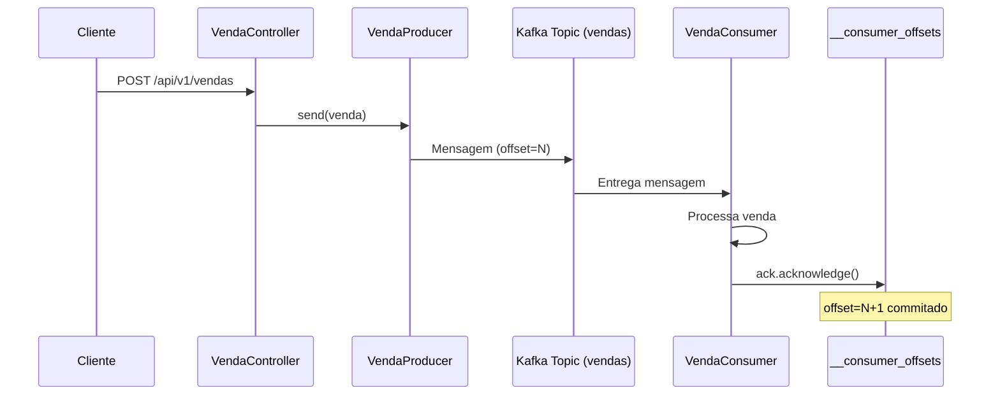

# 🔬 __consumer_offsets: Análise Técnica Profunda

## 📋 Resumo Executivo

O `__consumer_offsets` é o **sistema nervoso** do Apache Kafka para tracking de progresso de consumidores. É um tópico especial que funciona como "database distribuído" onde cada entrada representa o último ponto processado por um consumer group específico.

## 🧬 Anatomia Detalhada

### **Estrutura da Mensagem**

```json
// KEY (determina a partição e identifica unicamente o consumer)
{
  "version": 1,
  "group": "vendas-consumer-group",
  "topic": "vendas", 
  "partition": 0
}

// VALUE (contém o offset e metadados)
{
  "version": 1,
  "offset": 42,
  "metadata": "",
  "commit_timestamp": 1702564800000,
  "expire_timestamp": -1
}
```

### **Particionamento Inteligente**

```bash
# Fórmula de distribuição
partição = abs(hash(group_id)) % offsets.topic.num.partitions

# Para nosso sistema
hash("vendas-consumer-group") % 50 = partição_X
```

**Por que 50 partições?**
- 🎯 **Paralelismo**: Múltiplos consumer groups commitando simultaneamente
- ⚡ **Performance**: Distribui carga entre partições
- 🔄 **Escalabilidade**: Suporta milhares de consumer groups

## 🔄 Ciclo de Vida de um Offset

### **1. Criação Inicial**
```java
// Primeira vez que um consumer group processa uma partição
@KafkaListener(topics = "vendas", groupId = "vendas-consumer-group")
public void listen(...) {
    // Processa mensagem...
    ack.acknowledge(); // ← Cria primeira entrada no __consumer_offsets
}
```

### **2. Atualizações Subsequentes**
```bash
# Sequência de commits
offset=1 (timestamp: 10:00:00)
offset=2 (timestamp: 10:00:05) 
offset=3 (timestamp: 10:00:10)
# ... cada ack.acknowledge() gera uma nova entrada
```

### **3. Compactação (Log Compaction)**
```bash
# Estado antes da compactação
offset=1, offset=2, offset=3, offset=4, offset=5

# Após compactação (mantém apenas o mais recente)
offset=5
```

### **4. Expiração e Cleanup**
```bash
# Configuração de retenção
offsets.retention.minutes=10080  # 7 dias (padrão)

# Após 7 dias sem atividade do consumer group
VALUE = null  # Tombstone - remove o offset
```

## 🎯 Nosso Sistema na Prática

### **Mapeamento Real**

```bash
# Nossa configuração
Consumer Group: "vendas-consumer-group"
Topic: "vendas"
Partições: 1 (single partition por default)

# Entrada no __consumer_offsets
Partição: hash("vendas-consumer-group") % 50
Key: {"group":"vendas-consumer-group","topic":"vendas","partition":0}
Value: {"offset": X, "commit_timestamp": now}
```

### **Fluxo Completo de uma Venda**



## 🔍 Monitoramento e Debug

### **Via Kafdrop**
1. Acesse `http://localhost:9000`
2. Clique em `__consumer_offsets`
3. Navegue pelas partições
4. Procure por mensagens com key contendo seu `group_id`

### **Via Kafka CLI**
```bash
# Listar consumer groups
kafka-consumer-groups.sh --bootstrap-server localhost:9092 --list

# Detalhar consumer group específico
kafka-consumer-groups.sh --bootstrap-server localhost:9092 \
  --describe --group vendas-consumer-group

# Ver mensagens do __consumer_offsets (formato legível)
kafka-console-consumer.sh --bootstrap-server localhost:9092 \
  --topic __consumer_offsets --from-beginning \
  --formatter "kafka.coordinator.group.GroupMetadataManager\$OffsetsMessageFormatter"
```

### **Via Nossa API de Monitoramento**
```bash
# Status geral
GET /api/v1/monitoring/consumer-offsets-info

# Status do consumer group
GET /api/v1/monitoring/consumer-group-status

# Estatísticas de processamento
GET /api/v1/monitoring/processing-stats
```

## 🛡️ Garantias e Consistência

### **Exactly-Once Processing**
```java
// Nosso sistema garante exactly-once através de:
1. Producer idempotente (evita duplicatas na produção)
2. Consumer com acknowledgment manual (controle total do commit)
3. Idempotency service (evita reprocessamento de vendas)
```

### **Recuperação após Falhas**
```bash
# Cenário: Aplicação reinicia
1. Consumer group se reconecta ao Kafka
2. Kafka consulta __consumer_offsets
3. Recupera último offset commitado
4. Consumer continua de onde parou
```

### **Rebalancing**
```bash
# Quando consumer entra/sai do group
1. Kafka coordena rebalancing
2. Consulta __consumer_offsets para cada partição
3. Atribui partições aos consumers disponíveis
4. Cada consumer retoma do último offset commitado
```

## ⚠️ Cenários Problemáticos

### **1. Commit Perdido**
```java
// PROBLEMA: Falha antes do ack.acknowledge()
public void listen(...) {
    processVenda(record.value());
    // CRASH aqui - mensagem foi processada mas offset não foi commitado
    ack.acknowledge(); // Nunca executado
}

// RESULTADO: Reprocessamento na próxima inicialização
```

**Solução**: Nosso sistema usa idempotency service para detectar reprocessamento.

### **2. Commit Precoce**
```java
// PROBLEMA: Commit antes do processamento completo
public void listen(...) {
    ack.acknowledge(); // Commit precoce
    processVenda(record.value()); // Se falhar, mensagem é perdida
}
```

**Solução**: Sempre commit APÓS processamento bem-sucedido.

### **3. Consumer Lag**
```bash
# Consumer não consegue acompanhar ritmo de produção
Current Offset: 100
Log End Offset: 500
Lag: 400 mensagens
```

**Monitoramento**: Use Kafdrop ou métricas JMX para acompanhar lag.

## 🎛️ Configurações Avançadas

### **Tuning do __consumer_offsets**

```properties
# Número de partições (deve ser definido na criação do cluster)
offsets.topic.num.partitions=50

# Fator de replicação (alta disponibilidade)
offsets.topic.replication.factor=3

# Tamanho dos segmentos
offsets.topic.segment.bytes=104857600  # 100MB

# Compactação mais agressiva
offsets.retention.minutes=1440  # 24 horas (mais agressivo que padrão)
offsets.retention.check.interval.ms=600000  # 10 minutos

# Configurações de cleanup
log.cleanup.policy=compact
log.segment.ms=604800000  # 7 dias
```

### **Consumer Configuration**

```yaml
# application.yaml otimizado
spring:
  kafka:
    consumer:
      enable-auto-commit: false  # Manual commit obrigatório
      auto-offset-reset: earliest  # Para novos consumer groups
      session-timeout-ms: 30000  # Timeout de sessão
      heartbeat-interval-ms: 10000  # Heartbeat frequente
      max-poll-records: 10  # Processa poucos registros por vez
      isolation-level: read_committed  # Apenas mensagens commitadas
```

## 🧪 Testes e Experimentação

### **Script de Teste**

Execute nosso script de demonstração:

```bash
# Linux/macOS
chmod +x demo-consumer-offsets.sh
./demo-consumer-offsets.sh

# Windows PowerShell
.\demo-consumer-offsets.ps1
```

### **Cenários para Testar**

1. **Processamento Normal**
   - Envie vendas e observe offsets incrementando

2. **Idempotência**
   - Envie vendas duplicadas e veja offset avançar sem reprocessamento

3. **Restart da Aplicação**
   - Pare a aplicação, envie mensagens, reinicie
   - Observe consumer retomando do último offset

4. **Multiple Consumer Groups**
   - Configure outro consumer group
   - Observe offsets independentes

## 📊 Métricas Importantes

### **JMX Metrics**
```bash
# Offset lag por partição
kafka.consumer:type=consumer-fetch-manager-metrics,client-id={client-id},topic={topic},partition={partition}

# Commits por segundo
kafka.consumer:type=consumer-coordinator-metrics,client-id={client-id}
```

### **Nossa API Personalizada**
```bash
GET /api/v1/monitoring/processing-stats
GET /actuator/metrics/kafka.consumer.lag
```

## 🎯 Conclusão

O `__consumer_offsets` é **fundamental** para:

✅ **Garantir exactly-once processing**
✅ **Permitir recuperação após falhas**  
✅ **Coordenar múltiplos consumers**
✅ **Rastrear progresso de processamento**
✅ **Implementar rebalancing automático**

É literalmente o **"estado persistente"** que permite ao Kafka ser um sistema de mensageria confiável e resiliente! 🚀

---

**💡 Dica Final**: Use sempre o Kafdrop para visualizar este tópico - é a melhor maneira de entender como funciona na prática!
